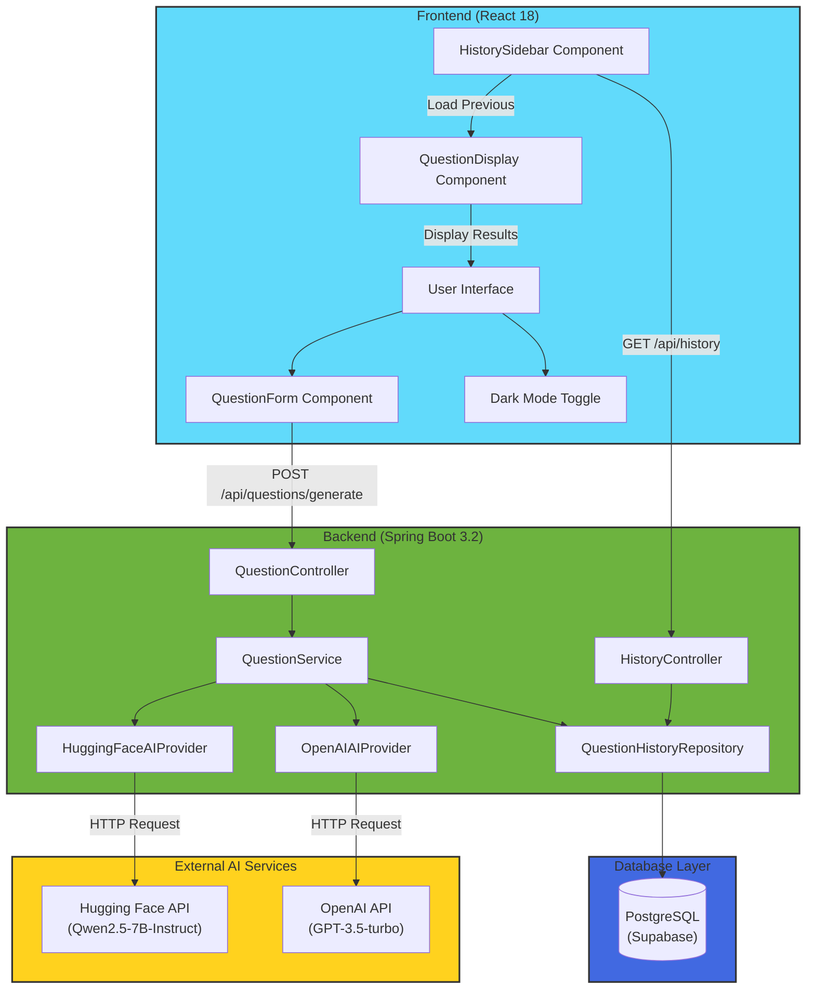
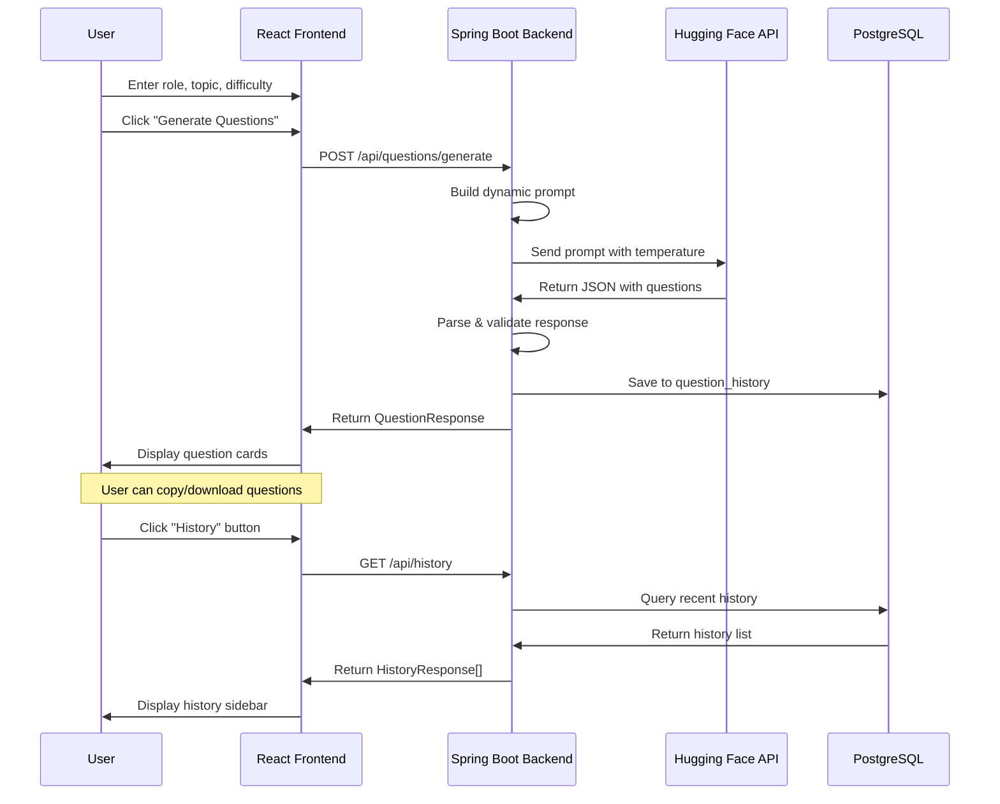

# Interview Question Generator 🎯

An AI-powered web application that generates tailored interview questions based on job role, topic, and difficulty level. Built with React, Spring Boot, PostgreSQL, and AI integration (Hugging Face/OpenAI).


---

## 📋 Table of Contents

- [Features](#-features)
- [Tech Stack](#-tech-stack)
- [Architecture](#-architecture)
- [Prerequisites](#-prerequisites)
- [Quick Start](#-quick-start)
- [API Endpoints](#-api-endpoints)
- [Project Structure](#-project-structure)
- [Configuration](#-configuration)
- [Screenshots](#-screenshots)
- [License](#-license)

---

## ✨ Features

### Core Features
- **Dynamic Question Generation**: Generate 5 technical + 3 behavioral questions tailored to specific roles and topics
- **Multiple Difficulty Levels**: Easy, Medium, Hard - each with optimized AI temperature settings
- **Sample Answers**: Optional AI-generated sample answers for each question
- **Question History**: PostgreSQL-backed storage to save and reuse previous generations

### UI/UX Features
- **Modern Card Layout**: Beautiful, responsive design with gradient themes
- **Dark Mode**: Toggle between light and dark themes (persisted in localStorage)
- **Copy & Download**: One-click copy individual questions or download all as text file
- **Loading Animations**: Skeleton cards and spinner during question generation
- **Toast Notifications**: Success/error feedback for all actions
- **Difficulty Tooltips**: Hover to see difficulty descriptions and AI temperature info

### AI Provider Support
- **Hugging Face** (Free) - Default provider using Qwen2.5-7B-Instruct model
- **OpenAI** (Paid) - GPT-3.5-turbo support with easy API key configuration

---

## 🛠 Tech Stack

| Layer | Technology | Purpose |
|-------|------------|---------|
| **Frontend** | React 18 | UI Components & State Management |
| **Styling** | CSS3 | Custom styling with CSS variables for theming |
| **Backend** | Spring Boot 3.2 | REST API & Business Logic |
| **Database** | PostgreSQL (Supabase) | Question History Storage |
| **ORM** | Spring Data JPA / Hibernate | Database Operations |
| **AI Provider** | Hugging Face API | Question Generation |
| **Build Tools** | Maven, npm | Dependency Management |

---

## 🏗 Architecture

### System Overview

```
┌─────────────────┐     HTTP/REST      ┌──────────────────┐
│                 │  ◄──────────────►  │                  │
│  React Frontend │                    │  Spring Boot API │
│  (Port 3000)    │                    │  (Port 8080)     │
│                 │                    │                  │
└─────────────────┘                    └────────┬─────────┘
                                                │
                         ┌──────────────────────┼──────────────────────┐
                         │                      │                      │
                         ▼                      ▼                      ▼
                ┌─────────────────┐    ┌─────────────────┐    ┌─────────────────┐
                │   PostgreSQL    │    │  Hugging Face   │    │    OpenAI API   │
                │   (Supabase)    │    │      API        │    │   (Optional)    │
                │                 │    │                 │    │                 │
                └─────────────────┘    └─────────────────┘    └─────────────────┘
                   Question History       AI Generation         AI Generation
```

### Component Architecture (Mermaid)



### Sequence Diagram (Data Flow)



### Data Flow Steps

1. **User Input** → Frontend form captures role, topic, difficulty
2. **API Request** → React sends POST to `/api/questions/generate`
3. **Prompt Construction** → Backend builds dynamic prompt with parameters
4. **AI Generation** → Hugging Face/OpenAI generates questions as JSON
5. **Response Parsing** → Backend parses and validates AI response
6. **History Save** → Questions saved to PostgreSQL for future reference
7. **Display** → Frontend renders questions in card layout

---

## 📦 Prerequisites

Before you begin, ensure you have the following installed:

| Requirement | Version | Download |
|-------------|---------|----------|
| **Java JDK** | 17 or higher | [Oracle](https://www.oracle.com/java/technologies/downloads/) / [Adoptium](https://adoptium.net/) |
| **Node.js** | 16 or higher | [nodejs.org](https://nodejs.org/) |
| **Maven** | 3.6 or higher | [maven.apache.org](https://maven.apache.org/download.cgi) |
| **Git** | Any recent version | [git-scm.com](https://git-scm.com/) |

### API Keys Required
- **Hugging Face API Key** (Free): [Get yours here](https://huggingface.co/settings/tokens)
- **PostgreSQL Database**: [Supabase](https://supabase.com) (Free tier available)

---

## 🚀 Quick Start

### Step 1: Clone the Repository

```bash
git clone https://github.com/yourusername/interview-question-generator.git
cd interview-question-generator
```

### Step 2: Configure Backend

1. Navigate to backend configuration:
```bash
cd backend/src/main/resources
```

2. Edit `application.properties`:
```properties
# PostgreSQL Configuration (Supabase)
spring.datasource.url=jdbc:postgresql://db.YOUR_PROJECT.supabase.co:5432/postgres
spring.datasource.username=postgres
spring.datasource.password=YOUR_PASSWORD

# Hugging Face API Key
huggingface.api.key=hf_YOUR_API_KEY_HERE
```

### Step 3: Run the Backend

```bash
cd backend

# Using Maven Daemon (faster)
mvnd clean install
mvnd spring-boot:run

# OR using regular Maven
mvn clean install
mvn spring-boot:run
```

Backend starts at: **http://localhost:8080**

### Step 4: Run the Frontend

Open a new terminal:

```bash
cd frontend

# Install dependencies
npm install

# Start development server
npm start
```

Frontend starts at: **http://localhost:3000**

### Step 5: Access the Application

Open your browser and navigate to: **http://localhost:3000**

---

## 📡 API Endpoints

### Question Generation

| Method | Endpoint | Description |
|--------|----------|-------------|
| `POST` | `/api/questions/generate` | Generate interview questions |
| `GET` | `/api/questions/health` | Health check |

**Request Body:**
```json
{
  "role": "Software Engineer",
  "topic": "Java",
  "difficulty": "medium",
  "includeAnswers": true
}
```

**Response:**
```json
{
  "technicalQuestions": [
    { "question": "What is polymorphism in Java?", "answer": "..." }
  ],
  "behavioralQuestions": [
    { "question": "Tell me about a time you led a team.", "answer": "..." }
  ]
}
```

### Question History

| Method | Endpoint | Description |
|--------|----------|-------------|
| `GET` | `/api/history` | Get recent question history |
| `GET` | `/api/history/{id}` | Get specific history item |
| `DELETE` | `/api/history/{id}` | Delete history item |
| `GET` | `/api/history/search?role=X` | Search by role/topic |

---

## 📁 Project Structure

```
interview-question-generator/
├── backend/                          # Spring Boot Application
│   ├── src/main/java/com/questiongenerator/
│   │   ├── QuestionGeneratorApplication.java    # Main entry point
│   │   ├── config/
│   │   │   ├── CorsConfig.java                  # CORS configuration
│   │   │   └── OpenAIConfig.java                # OpenAI settings
│   │   ├── controller/
│   │   │   ├── QuestionController.java          # Question generation API
│   │   │   └── HistoryController.java           # History CRUD API
│   │   ├── dto/
│   │   │   ├── QuestionRequest.java             # Input DTO
│   │   │   ├── QuestionResponse.java            # Output DTO
│   │   │   └── HistoryResponse.java             # History DTO
│   │   ├── entity/
│   │   │   └── QuestionHistory.java             # JPA Entity
│   │   ├── repository/
│   │   │   └── QuestionHistoryRepository.java   # Data Access
│   │   └── service/
│   │       ├── AIProvider.java                  # Provider interface
│   │       ├── HuggingFaceAIProvider.java       # Hugging Face impl
│   │       ├── OpenAIAIProvider.java            # OpenAI impl
│   │       └── QuestionService.java             # Business logic
│   ├── src/main/resources/
│   │   └── application.properties               # Configuration
│   └── pom.xml                                  # Maven dependencies
│
├── frontend/                         # React Application
│   ├── public/
│   │   └── index.html
│   ├── src/
│   │   ├── components/
│   │   │   ├── QuestionForm.js/.css             # Input form
│   │   │   ├── QuestionDisplay.js/.css          # Results display
│   │   │   ├── QuestionCard.js/.css             # Individual card
│   │   │   ├── LoadingSpinner.js/.css           # Loading state
│   │   │   ├── DarkModeToggle.js/.css           # Theme toggle
│   │   │   ├── Toast.js/.css                    # Notifications
│   │   │   └── HistorySidebar.js/.css           # History panel
│   │   ├── App.js                               # Main component
│   │   ├── App.css                              # Main styles
│   │   └── index.js                             # Entry point
│   └── package.json                             # npm dependencies
│
└── README.md                         # This file
```

---

## ⚙️ Configuration

### AI Provider Settings

The application supports two AI providers. Configure in `application.properties`:

**Hugging Face (Default - Free):**
```properties
ai.provider=huggingface
huggingface.api.key=hf_your_key_here
```

**OpenAI (Paid):**
```properties
ai.provider=openai
openai.api.key=sk-your_key_here
```

### Temperature Settings

Different difficulty levels use different AI creativity settings:

| Difficulty | Temperature | Behavior |
|------------|-------------|----------|
| Easy | 0.6 | More focused, predictable questions |
| Medium | 0.7 | Balanced creativity |
| Hard | 0.8 | More varied, creative questions |

### Database Configuration

Using Supabase PostgreSQL:
```properties
spring.datasource.url=jdbc:postgresql://db.xxxx.supabase.co:5432/postgres
spring.datasource.username=postgres
spring.datasource.password=your_password
spring.jpa.hibernate.ddl-auto=update
```

---

## 🖼 Screenshots

### Main Interface
- Clean, modern design with gradient background
- Intuitive form with role, topic, and difficulty inputs
- Real-time validation and loading states

### Question Cards
- Beautiful card layout with technical/behavioral separation
- Copy button on each card
- Expandable answers section

### Dark Mode
- Full dark theme support
- Persisted user preference
- All components themed consistently

### History Sidebar
- Slide-out panel with saved questions
- Search functionality
- One-click reload previous generations

---

## 🔒 Security Notes

- API keys should never be committed to version control
- Use environment variables for production deployments
- CORS is configured for localhost development only

---

## 👨‍💻 Author

**Subhadeep Mondal**

---

## 🙏 Acknowledgments

- Hugging Face for free AI inference API
- Supabase for free PostgreSQL hosting
- Spring Boot & React communities
